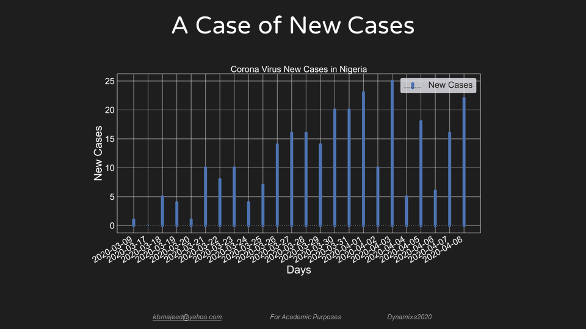
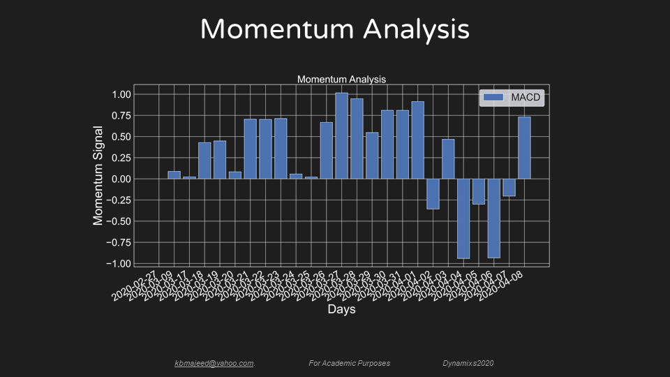
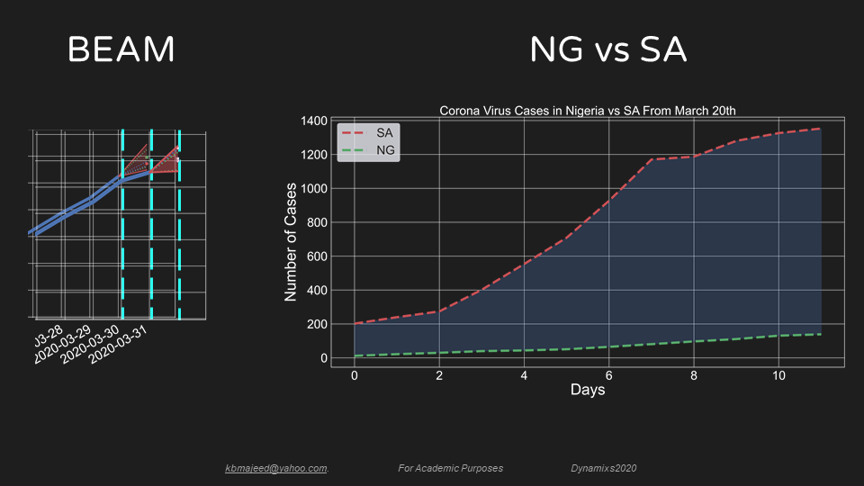

# COVID-19 Case Data and Forecasting in Nigeria
  
The Coronavirus disease COVID-19 at this point of writing is a pandemic that has rampaged planet earth. It is regarded as a global threat and in some quarters an existential threat. Every possible effort should be made in the application of mathematical models, artificial intelligence, big data, and other resources to stem the spread of this disease.  

### [1] Introduction
These data are useful as they present facts that drive analytics on COVID-19 cases in Nigeria. It also represents an early reference that can be used in the future. Academic institutions, public health agencies, scientific communities, researchers, students, and self-explorers can use this data, model, code, and analysis to explore and develop reliable insights on COVID-19 cases in Nigeria and beyond. The data – with daily updates, model, code, and analysis presented can be applied to drive analytics, policy development, and decision making in other countries where data is scarce. An ensemble of models leverages the strengths and compensates for weaknesses in the individual forecasting algorithms even with limited data.  

### [2] Dataset and Repository
**Description:**  
The daily total number of COVID-19 cases in Nigeria from February 27, 2020 to April 5, 2020 were automatically mined every 24 hours from the official websites of NCDC and Wikipedia using a python script `nigeria_covid19.py`. The dataset is in raw Excel file format `nigeria_covid19.csv/xlsx`. Dataset with daily updated case numbers can be found in `nigeria_covid19_updated.xlsx`

**Files:**  
**`nigeria_covid19.csv`**,  
**`nigeria_covid19.xlsx`**,  
**`nigeria_covid19_updated.csv`**,  

**Sources:**  
Nigeria Center for Disease Control – NCDC http://covid19.ncdc.gov.ng/  
COVID-19 Pandemic in Nigeria – Wikipedia http://tiny.cc/nigeria_covid19  

### [3] Code  
**Description:**  
This segment of the automated script mines data on COVID-19 case numbers in Nigeria  

**Files:**  
**`nigeria_covid19.py`**  

### [4] Forecasting with Limited Data

**Data-in-Brief**  
Link to Data-in-Brief article submitted to Elsevier [//url]  

**Citing this work**  
If you like this work, kindly star this repository by clicking the
star button at the top of the page. If you want to get updated datasets
you can follow this repository by clicking the watch button as well.
  
### [5] Acknowledgement  
  We would like to thank the Abdulmajeeds for their support and consideration. 
  Appreciation goes to the enitre Uniosun community for their encouragement.
  
### [6] Media  
  
  **(1) Forecasts for April 11, 2020**
    
  
  **(2) A Case of New Cases **
    
  
  **(3) Momentum Analysis **
    
  
  **(4) A Comparison between Nigeria and South Africa**
    
  
  **(5) Comparison of Models **
    
  
